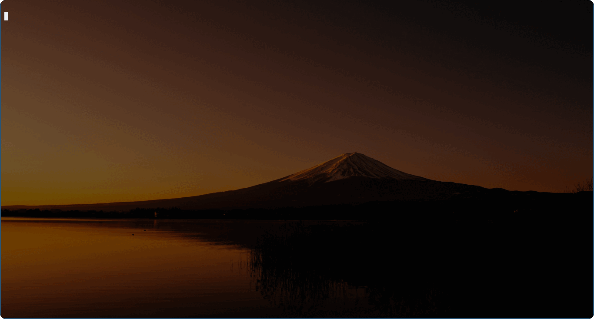

<div align="center">


# 🔍 freasearcher

</div>

<table>
  <thead>
    <tr>
      <th style="text-align:center"><a href="README.md">日本語</a></th>
      <th style="text-align:center">English</th>
    </tr>
  </thead>
</table>

<div align="center">

Command line tool to quickly search and browse on the terminal using [Frea Search](https://freasearch.org/)'s API

**⚠️ Frea Search is currently in Beta version. Responses may be slow or time out. Please be patient.**

</div>



## 🚀 Treatment

```
# Search by keyword and open in browser
freasearcher -w keyword

# Specify multiple keywords
freasearcher -w "search some keyword"

# Display URL and exit
freasearcher -u -w keyword
```

**Note⚠️ : The default search language is set to Japanese. It cannot be changed at this time.**

1. execute the command with the keyword(s) you wish to search for as an argument
1. Refine your search results with the fuzzyfinder. Use `Ctrl-N`, `Ctrl-P` or `Ctrl-J`, `Ctrl-K` to move the focus. Select with `Tab` key and confirm with `Enter` key.
1. The URL of the selected site is output.

### 🌏 Open the article page in your browser

The ability to open a page of articles in your browser has been implemented!!! 🎉
You can also add the `-u` option to display the URL and exit.

### ⚡ Advanced Search

Not yet... 💤

## ⬇️  Install

Download the executable binary from the release page.

> [Latest Release]()

Not yet... 💤

To build from source, clone this repository and run `go install`.
Developed on `go1.18.2 linux/amd64`.

To `go install`, run the following.
`go install https://github.com/Ablaze-MIRAI/freasearcher@latest`

## ⛏️  Development

```sh
# install dependencies
go mod tidy

# Run freasearcher
go run main.go

# Build
go build
```

This repository uses `[pre-commit](https://pre-commit.com)`.
To use `pre-commit`, run the following command.

`pre-commit install`

## 📝 Todo

- [ ] Additional search options
- [ ] FreaSearch API Documentation

## 📜 License

[MIT LICENSE](LICENSE)

### 🧩 Modules
|ID|Version|License|
|:---|:---|:---|
|github.com/gdamore/encoding|v1.0.0|Apache-2.0|
|github.com/gdamore/tcell/v2|v2.4.0|Apache-2.0|
|github.com/google/go-cmp|v0.5.7|BSD-3-Clause|
|github.com/google/gofuzz|v1.2.0|Apache-2.0|
|github.com/ktr0731/go-fuzzyfinder|v0.6.0|MIT|
|github.com/lucasb-eyer/go-colorful|v1.0.3|MIT|
|github.com/mattn/go-runewidth|v0.0.13|MIT|
|github.com/nsf/termbox-go|v0.0.0-20201124104050-ed494de23a00|MIT|
|github.com/pkg/errors|v0.9.1|BSD-2-Clause|
|github.com/rivo/uniseg|v0.2.0|MIT|
|github.com/skratchdot/open-golang|v0.0.0-20200116055534-eef842397966|MIT|
|github.com/tidwall/gjson|v1.14.1|MIT|
|github.com/tidwall/match|v1.1.1|MIT|
|github.com/tidwall/pretty|v1.2.0|MIT|
|golang.org/x/crypto|v0.0.0-20220525230936-793ad666bf5e|BSD-3-Clause|
|golang.org/x/net|v0.0.0-20211112202133-69e39bad7dc2|BSD-3-Clause|
|golang.org/x/sys|v0.0.0-20210630005230-0f9fa26af87c|BSD-3-Clause|
|golang.org/x/term|v0.0.0-20201210144234-2321bbc49cbf|BSD-3-Clause|
|golang.org/x/text|v0.3.6|BSD-3-Clause|
|golang.org/x/tools|v0.0.0-20180917221912-90fa682c2a6e|BSD-3-Clause|
|golang.org/x/xerrors|v0.0.0-20200804184101-5ec99f83aff1|BSD-3-Clause|

## 👏  Impacted Projects

- [sheepla/fzwiki](https://github.com/sheepla/fzwiki)
- [sheepla/fzenn](https://github.com/sheepla/fzenn)

## 💕  Special thanks
mattn
- [mattn/go-runewidth](https://github.com/mattn/go-runewidth)

ktr0731
- [ktr0731/go-fuzzyfinder](https://github.com/ktr0731/go-fuzzyfinder)

Markus Heiser & Alexandre Flament
- [searxng/searxng](https://github.com/searxng/searxng)

kemokemo
- [kemokemo/gomrepo](https://github.com/kemokemo/gomrepo)
