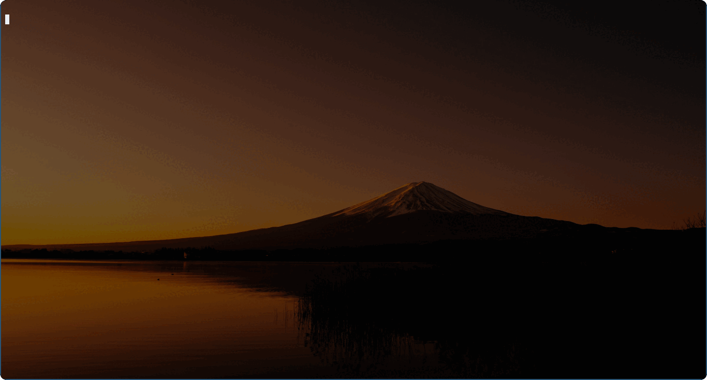

<div align="center">


# 🔍 freasearcher

</div>

<table>
  <thead>
    <tr>
      <th style="text-align:center">日本語</th>
      <th style="text-align:center"><a href="README.en.md">English</a></th>
    </tr>
  </thead>
</table>

<div align="center">

[Frea Search](https://freasearch.org/)のAPIを用いて素早く検索し、ターミナル上で閲覧できるコマンドラインツール

**⚠️ Frea Searchは現在Beta版です。応答が遅くなったりタイムアウトする可能性があります。ご了承下さい。**

</div>



## 🚀 使い方

```
# キーワードで検索し、ブラウザで開く
freasearcher -w keyword

# 複数キーワードを指定する
freasearcher -w "search some keyword"

# URLを表示して終了する
freasearcher -u -w keyword
```

**注意⚠️ : デフォルトの検索言語は日本語に設定されています。また、現状変更出来ません。**

1. 引数に検索したいキーワードを指定してコマンドを実行します。
1. 検索結果をfuzzyfinderで絞り込みます。`Ctrl-N`, `Ctrl-P` または `Ctrl-J`, `Ctrl-K` でフォーカスを移動します。 `Tab`キーで選択し `Enter` キーで確定します。
1. 選択したサイトのURLが出力されます。

### 🌏 ブラウザで記事のページを開く

ブラウザで記事のページを開く機能が実装されました！🎉
また、`-u`オプションを追加するとURLを表示して終了することも可能です。

### ⚡ 高度な検索

Not yet... 💤

## ⬇️  インストール

リリースページから実行可能なバイナリをダウンロードしてください。

> [Latest Release]()

Not yet... 💤

ソースからビルドする場合は、このリポジトリをクローンして `go install` を実行してください。
`go1.18.2 linux/amd64`にて開発しています。

`go install`をする場合は以下のように実行してください。
`go install https://github.com/Ablaze-MIRAI/freasearcher@latest`

## ⛏️   開発

```sh
# install dependencies
go mod tidy

# Run freasearcher
go run main.go

# Build
go build
```

このリポジトリでは`[pre-commit](https://pre-commit.com)`を採用しています。
`pre-commit`を使うには以下のコマンドを実行してください。

`pre-commit install`

## 📝 Todo

- [ ] 検索オプションの追加
- [x] 英語のドキュメントの準備<br>
[完了しました！](https://github.com/Ablaze-MIRAI/freasearcher/commit/6295d8f993fe135ad90c33d96d87634d68c26c36)@code-raisan ありがとう！💕
- [ ] FreaSearch APIのドキュメント

## 📜 ライセンス

[MIT LICENSE](LICENSE)

### 🧩 Modules
|ID|Version|License|
|:---|:---|:---|
|github.com/gdamore/encoding|v1.0.0|Apache-2.0|
|github.com/gdamore/tcell/v2|v2.4.0|Apache-2.0|
|github.com/google/go-cmp|v0.5.7|BSD-3-Clause|
|github.com/google/gofuzz|v1.2.0|Apache-2.0|
|github.com/ktr0731/go-fuzzyfinder|v0.6.0|MIT|
|github.com/lucasb-eyer/go-colorful|v1.0.3|MIT|
|github.com/mattn/go-runewidth|v0.0.13|MIT|
|github.com/nsf/termbox-go|v0.0.0-20201124104050-ed494de23a00|MIT|
|github.com/pkg/errors|v0.9.1|BSD-2-Clause|
|github.com/rivo/uniseg|v0.2.0|MIT|
|github.com/skratchdot/open-golang|v0.0.0-20200116055534-eef842397966|MIT|
|github.com/tidwall/gjson|v1.14.1|MIT|
|github.com/tidwall/match|v1.1.1|MIT|
|github.com/tidwall/pretty|v1.2.0|MIT|
|golang.org/x/crypto|v0.0.0-20220525230936-793ad666bf5e|BSD-3-Clause|
|golang.org/x/net|v0.0.0-20211112202133-69e39bad7dc2|BSD-3-Clause|
|golang.org/x/sys|v0.0.0-20210630005230-0f9fa26af87c|BSD-3-Clause|
|golang.org/x/term|v0.0.0-20201210144234-2321bbc49cbf|BSD-3-Clause|
|golang.org/x/text|v0.3.6|BSD-3-Clause|
|golang.org/x/tools|v0.0.0-20180917221912-90fa682c2a6e|BSD-3-Clause|
|golang.org/x/xerrors|v0.0.0-20200804184101-5ec99f83aff1|BSD-3-Clause|

## 👏 影響を受けたプロジェクト

- [sheepla/fzwiki](https://github.com/sheepla/fzwiki)
- [sheepla/fzenn](https://github.com/sheepla/fzenn)

## 💕  スペシャルサンクス
mattn
- [mattn/go-runewidth](https://github.com/mattn/go-runewidth)

ktr0731
- [ktr0731/go-fuzzyfinder](https://github.com/ktr0731/go-fuzzyfinder)

Markus Heiser & Alexandre Flament
- [searxng/searxng](https://github.com/searxng/searxng)

kemokemo
- [kemokemo/gomrepo](https://github.com/kemokemo/gomrepo)
